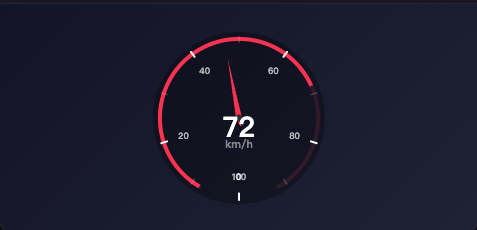
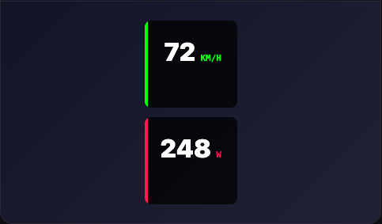
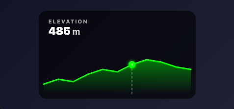

# gpxvideoeditor – GPX Video Editor for Cyclists

**gpxvideoeditor**: A native macOS app that turns your GPX ride data into stunning HUD overlay videos.
Import GPX tracks from Garmin, Strava, or cycling computers — automatically generate animated speed, elevation, power, and heart rate overlays on your cycling videos.

**gpxvideoeditor**：macOS 原生骑行 GPX 视频生成工具。
导入 GPX 轨迹，自动生成速度/海拔/功率/心率动画 HUD 叠加视频，支持 Garmin、Strava、骑行码表数据。

  

---

## Features / 功能

gpxvideoeditor fuses your GPX sports data with video, overlaying beautiful HUD layers that display real-time cycling metrics:

gpxvideoeditor 将你的 GPX 运动数据与视频完美融合，用精美 HUD 叠加层展示实时骑行数据：

- **GPX Track Import** — Supports GPX files from Garmin, Strava, Wahoo and more; auto-parses speed, elevation, heart rate, power, and cadence
  **GPX 轨迹导入** — 支持 Garmin、Strava、Wahoo 等设备导出的 GPX 文件，自动解析速度、海拔、心率、功率、踏频等数据
- **30+ HUD Styles** — Classic Dial, Modern Bar, F1 Telemetry, Cyberpunk, visionOS Glass and more — find the perfect look for your ride video
  **30+ HUD 风格** — 涵盖 Classic Dial、Modern Bar、F1 Telemetry、Cyberpunk、visionOS Glass 等多种风格，总有一款适合你的骑行视频
- **Real-Time Data Animation** — Speedometer, elevation profile, power curve, and heart rate zone animate in sync with your video timeline
  **实时数据动画** — 速度表、海拔剖面图、功率曲线、心率区间，随视频时间轴同步变化
- **Native macOS Experience** — Built with Swift, smooth and efficient, fully optimized for Apple Silicon
  **macOS 原生体验** — 基于 Swift 构建，流畅高效，完美适配 Apple Silicon
- **100% Local Processing** — All data processing and video rendering happen on your device. No personal data is ever uploaded
  **100% 本地处理** — 所有数据处理与视频渲染均在本地完成，不上传任何个人信息

## HUD Styles Showcase / HUD 风格展示

gpxvideoeditor offers a rich collection of HUD styles across 7 categories:

gpxvideoeditor 提供丰富的 HUD 风格，覆盖 7 大类别：

| Category | Styles |
|----------|--------|
| **Classic Dial** | Apple Watch, Aviator Instrument, Cafe Racer, Classic, Cyberpunk, Drone OSD, Grand Tourer, Hypercar Neon, Minimalist Volt, Spatial Glass |
| **Digital** | Cinematic Minimal, Glass Widget, Tactical OSD |
| **Dual Analog** | Apex Edge, Classic Twin Pods, Hypercar Binnacle, Track Demon |
| **Elevation** | Cinematic Fade, Classic, Holographic Scan, Pro Wireframe |
| **Hex** | Cyber Mecha, Pro Telemetry, visionOS Glass |
| **Modern Bar** | F1 Telemetry, Glitch Diagnostics, Hexagon Cluster, Mecha Vector, Minimalist Slash, Plasma Railgun, Sci-Fi Capsule, Supercar Rev |
| **Track** | Classic, Glass Explorer, Pro Racing, Tactical Radar |

## Installation / 安装

Download gpxvideoeditor from the Mac App Store:

从 Mac App Store 下载 gpxvideoeditor：

**System Requirements / 系统要求**: macOS 14.0 or later / macOS 14.0 或更高版本

## Usage / 使用方法

1. **Import Video** — Open gpxvideoeditor and drag in your cycling video file
   **导入视频** — 打开 gpxvideoeditor，拖入你的骑行视频文件
2. **Import GPX** — Load a GPX track file exported from Garmin / Strava / cycling computer
   **导入 GPX** — 导入 Garmin / Strava / 码表导出的 GPX 轨迹文件
3. **Choose HUD Style** — Pick from 30+ HUD templates, customize data types and colors
   **选择 HUD 风格** — 从 30+ 种 HUD 模板中选择，自定义数据类型与配色
4. **Preview & Export** — Real-time preview of HUD overlay, export the final video with animated data
   **预览 & 导出** — 实时预览 HUD 叠加效果，导出带数据动画的成品视频

## Tutorial Videos / 教程视频

Watch gpxvideoeditor tutorials and demo videos:

观看 gpxvideoeditor 使用教程与效果演示：

- [gpxvideoeditor Tutorial - YouTube](https://www.youtube.com/watch?v=pYpvSyjkC5g&t=17s)
- [gpxvideoeditor HUD Showcase - YouTube](https://www.youtube.com/watch?v=Ra_OYaELHeM)

## FAQ / 常见问题

**Q: What GPX data does gpxvideoeditor support?**
A: Speed, elevation, heart rate, power, cadence, distance and more. Compatible with GPX files from Garmin, Strava, Wahoo and other major platforms.

**Q: gpxvideoeditor 支持哪些 GPX 数据？**
A: 支持速度、海拔、心率、功率、踏频、距离等常见骑行数据字段，兼容 Garmin、Strava、Wahoo 等主流平台导出的 GPX 文件。

**Q: Is my data uploaded to any server?**
A: No. gpxvideoeditor processes everything 100% locally. All video rendering and GPX parsing happen on your Mac. No personal data is collected. [View Privacy Policy](https://jjguoxh.github.io/gpx-privacy/)

**Q: 数据会上传到服务器吗？**
A: 不会。gpxvideoeditor 100% 本地处理，所有视频渲染和 GPX 解析均在你的 Mac 上完成，不收集任何个人信息。[查看隐私政策](https://jjguoxh.github.io/gpx-privacy/)

**Q: What video export formats are supported?**
A: Multiple resolutions and frame rates, optimized for YouTube, Instagram, and other major video platforms.

**Q: Is gpxvideoeditor free?**
A: Please check the Mac App Store for the latest pricing.

**Q: gpxvideoeditor 是免费的吗？**
A: 请前往 Mac App Store 查看最新定价信息。

## Links / 链接

- **Mac App Store**: [gpxvideoeditor on the App Store](https://apps.apple.com/app/gpxvideoeditor/id6762338535)
- **Product Page / 官网**: [gpxvideoeditor](https://jjguoxh.github.io/gpx-privacy/home.html)
- **Privacy Policy / 隐私政策**: [GPXVideoEditor Privacy Policy](https://jjguoxh.github.io/gpx-privacy/)

## Keywords / 关键词

`gpxvideoeditor` `gpx video editor` `gpx video generator` `cycling video` `bike video` `garmin video` `strava video` `hud overlay` `speed animation` `elevation profile` `route animation` `macos app` `swift` `cycling` `bike` `gpx` `video editor` `riding video` `sport video` `workout video` `骑行视频` `GPX视频编辑器` `运动视频` `轨迹动画` `码表数据`
